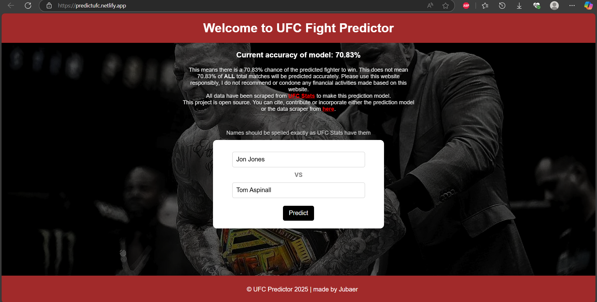

# UFC Fight Predictor




This project leverages machine learning techniques to predict the outcomes of UFC fights.  
By analyzing fighters' statistics, the model forecasts the likely winner between two competitors. [Website](https://predictufc.netlify.app)

**Models
**: Logistics Regression, XGBoost, Random Forest, MLP Neural Network

## Installation Instructions

To set up the project locally, follow these steps:

1. **Clone the Repository**:
   ```bash
   git clone https://github.com/jabhuiyan/ufc-fight-predictor.git

2. **Navigate to the Project Directory**:
   ```bash
   cd ufc-fight-predictor

3. **Set Up a Virtual Environment (optional but recommended)**:
   ```bash
   python3 -m venv venv
   source venv/bin/activate  # On Windows, use 'venv\Scripts\activate'

4. **Install Required Packages**:
   ```bash
   pip install -r requirements.txt


This model was made from scraping all fights and fighters data current as of Mar 22, 2025 from [UFC Stats](http://ufcstats.com/statistics/events/completed). The data was then cleaned, stored, analysed, used for feature engineering, feature selection, and then used to train various models with hyperparameter tuning for best accuracy. The most accurate model was then chosen and pickled to be used for the web application.

## ETL (Extract, Transform, Load)

The ETL process involves:

- **Extract**: Data is scraped from relevant UFC statistics websites using the `run_scraper.py` script.​

- **Transform**: The extracted data undergoes cleaning and preprocessing to ensure consistency and accuracy.​ Some fights had a draw or NC (No Contest) as a result. Winner of these fights were replaced with 'Unknown' variable. Many fights and fighters in the early UFC days had missing statistics. These were handled accordingly. All fight stats were transformed into percentage form with calculations. Stats with time format were transformed into decimal format for calculation.

- **Load**: The transformed data is stored in a structured format within the `datasets` directory for further analysis. A data pipeline template with PostgreSQL is provided in the `db` directory.


## Data Features

The dataset includes the following features for each fighter:

- **Striking Stats**: Significant strikes landed, striking accuracy, etc.​

- **Takedown Stats**: Takedowns landed, takedown accuracy, etc.​

- **Submission Stats**: Submission attempts, submission success rate, etc.​


## Data Analysis

Exploratory data analysis (EDA) is conducted to uncover patterns and relationships within the data.
Visualizations and statistical summaries help in understanding distributions, identifying outliers, and revealing trends that inform model development.


## Feature Engineering

In this phase, new features are created to enhance the predictive power of the model. Feature engineering steps include:

- Calculating new metrics such as strike differential.​

- Normalizing data to ensure comparability between fighters.​

- Encoding categorical variables appropriately.​

Such engineered features aim to capture nuanced aspects of fighters' capabilities.


## Feature Selection

To optimize the model's performance, a subset of relevant features is selected based on:

**Statistical Tests**: Evaluating the correlation between features and fight outcomes.

**Domain Knowledge**: Incorporating insights from UFC analytics to identify impactful features.

This process ensures that the model focuses on the most informative attributes.


## Tech Stacks Used

The project utilizes:

**Programming Language**: Python, JavaScript, HTML, CSS, shell

**Web Scraping**: Spyder

**Libraries**: Pandas, NumPy, Scikit-learn, Matplotlib

**Database**: Postgres, NoSQL

**Web Framework**: Flask

**Deployment**: Render (backend), Netlify (frontend)


------------------------------------------------

#### Prediction model v1.0
-------------------------------------------------

model accuracy: 66.76%

model features: striking, takedown and submission stats of two fighters

model was used on UFC Fight Night 254 main card event where it successfully predicted Sean Brady, Carlos Ulberg, Alexia Thainara and Nathaniel Wood as the winners but failed to predict Kevin Holland and Chris Duncan winning their fights, thereby scoring 4 out of 6 predictions, i.e, 66.66% accuracy rae which was consistent with the model accuracy report.

----------------------------------------------------

#### Prediction model v1.1
-------------------------------------------------

model accuracy: 70.83%

model features: striking, takedown and submission stats of two fighters
